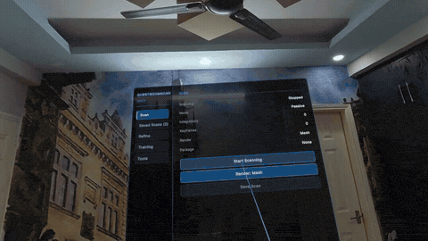
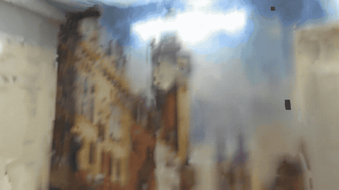

# QuestRoomScan

Real-time 3D room reconstruction on Meta Quest 3. Produces a textured mesh from depth + RGB camera data using GPU TSDF volume integration and Surface Nets mesh extraction, with server-based Gaussian Splat training and on-device rendering via [Unity Gaussian Splatting](https://github.com/arghyasur1991/UnityGaussianSplatting).

| Scanning (Triplanar) | Vertex Colors |
|:---:|:---:|
|  |  |

| Texture Refinement | Gaussian Splat |
|:---:|:---:|
|  |  |

**[Full demo video](https://www.youtube.com/watch?v=lEn3GkH7Yao)** — recorded before multi-view blending, GPU sharpening, and atlas enhancement were added; current output quality is noticeably better.

## Table of Contents

- [Features](#features)
- [Requirements](#requirements)
- [Installation](#installation)
- [Quick Start](#quick-start)
- [Usage Flow](#usage-flow)
  - [Scanning](#scanning)
  - [Freeze / Unfreeze](#freeze--unfreeze)
  - [Training Gaussian Splats](#training-gaussian-splats)
  - [Texture Refinement](#texture-refinement)
  - [Atlas Enhancement (HQ Refine)](#atlas-enhancement-hq-refine)
  - [Mesh Enhancement](#mesh-enhancement)
  - [Saving and Loading](#saving-and-loading)
  - [Architecture](#architecture)
- [Gaussian Splat Pipeline](#gaussian-splat-pipeline)
- [VR Debug Menu](#vr-debug-menu)
- [Memory Budget (Quest 3)](#memory-budget-quest-3)
- [Comparison with Hyperscape](#comparison-with-hyperscape)
- [Game Integration Guide](#game-integration-guide)
- [Credits & Prior Art](#credits--prior-art)
- [License](#license)

## Features

- **GPU TSDF Integration** — Depth frames fused into a signed distance field via compute shaders
- **GPU Surface Nets Meshing** — Fully GPU-driven mesh extraction via compute shaders with zero CPU readback, rendered via a single `Graphics.RenderPrimitivesIndirect` draw call
- **Two-Layer Real-Time Texturing** — Triplanar world-space cache (~8mm/texel persistent surface color from passthrough RGB) with vertex color fallback (~5cm). Triplanar can be disabled via inspector toggle to save ~192MB GPU memory when not needed (e.g., if only post-scan refined textures matter). Keyframes captured as motion-gated JPEGs to disk for texture refinement and Gaussian Splat training.
- **Package-Based Persistence** — Multi-scan persistence system where each scan is a self-contained package (`pkg_YYYYMMDD_HHMMSS/`) with its own TSDF, triplanar textures, keyframes, splat, and refined textures. Scan browser in the debug menu lists all saved packages. Artifacts (splat, refined, HQ) auto-save to the active package on creation.
- **OVRSpatialAnchor Relocation** — `RoomAnchorManager` creates a persisted `OVRSpatialAnchor` per scan package for reliable cross-session relocation. Per-artifact creation matrices in `anchor.json` track when each artifact was created relative to the spatial anchor, enabling accurate relocation even for artifacts created across different sessions. Falls back to MRUK floor anchor if spatial anchor localization fails.
- **Temporal Stabilization** — Adaptive per-vertex temporal blending on GPU prevents mesh jitter while allowing fast convergence
- **Exclusion Zones** — Cylindrical rejection around tracked heads prevents body reconstruction (configurable radius and height, up to 64 zones)
- **Gaussian Splat Training & Rendering** — Keyframe capture + point cloud export → PC server training → trained PLY download → on-device UGS rendering
- **VR Debug Menu** — Two-panel world-space UI Toolkit HUD with left navigation (Scan, Saved Scans, Refine, Gaussian Splat, Tools) and right detail views. Includes scan browser with load/delete per package, context-sensitive artifact deletion, and dynamic button disabled states. Navigation tabs for Refine and Gaussian Splat are automatically disabled when their respective modules are not attached.
- **Texture Refinement** — Post-scan texture refinement using captured keyframes. GPU compute shader bakes a UV atlas from the best-scoring keyframe projections per texel, with multi-view blending, occlusion-aware depth testing, and GPU unsharp-mask sharpening. Produces sharp, seamless textures from captured keyframes. `TextureRefinement` is an instance-based MonoBehaviour module — all configuration (xatlas options, bake settings, sharpen/seam parameters) is via inspector fields on the component.
- **Atlas Enhancement (HQ Refine)** — Server-side atlas super-resolution via Real-ESRGAN (2x/4x configurable) + LaMa inpainting. Uploads the on-device refined atlas as PNG, enhances, and downloads the result. Configurable SR scale via inspector.
- **Mesh Enhancement** — Server-side mesh smoothing via bilateral normal filter + optional RANSAC plane detection and vertex snapping. Enhanced mesh saved as a separate artifact preserving the original refined mesh.
- **Render Mode Switching** — Cycle between Wireframe, Vertex, Triplanar, Refined, HQRefined, Splat, and None at runtime via debug menu or controller binding (default: A/X button). Unavailable modes are automatically skipped during cycling (e.g., Triplanar requires `TriplanarCache`, Splat requires trained data).
- **Freeze Tint Toggle** — Independent toggle (not tied to render mode) shows/hides a blue tint overlay on frozen voxels in live mesh modes (Vertex, Triplanar, Wireframe). Bindable via `RoomScanInputHandler`.
- **Game Integration APIs** — `LoadRefinedOnlyAsync()` for fast game-mode loading (skips TSDF/Surface Nets reconstruction, loads only the baked mesh + atlas). `ReleaseScanResources()` frees ~400-500 MB GPU memory after scanning. Public `RefinedMesh`/`RefinedAtlas` properties and `RefinedMeshReady` event for custom rendering. `ScanCoverage`/`ScanProgress` structs expose scan metrics for guided UX.
- **Post-Bake Mesh Simplification** — UV-preserving mesh simplification via `meshopt_simplifyWithAttributes` runs after atlas baking (configurable ratio), preserving texture quality. Replaces the old broken pre-bake decimation.

## Requirements

- **Unity 6** (6000.x)
- **URP** (Universal Render Pipeline)
- **Meta Quest 3** (depth sensor required)

### Dependencies

| Package | Version | Notes |
|---------|---------|-------|
| `com.unity.xr.arfoundation` | 6.1+ | Depth frame access |
| `com.unity.render-pipelines.universal` | 17.0+ | URP rendering pipeline |
| `com.meta.xr.mrutilitykit` | 85+ | Passthrough camera RGB access |
| `com.unity.burst` | 1.8+ | Required by Collections/Mathematics |
| `com.unity.collections` | 2.4+ | NativeArray for plane detection |
| `com.unity.mathematics` | 1.3+ | Math types used throughout |
| `org.nesnausk.gaussian-splatting` | [fork](https://github.com/arghyasur1991/UnityGaussianSplatting) | **Optional** — Gaussian splat rendering with runtime PLY loading |

Additional project-level dependencies (not in `package.json` — installed via Meta's SDK or XR plugin management):
- `com.unity.xr.meta-openxr` (bridges Meta depth to AR Foundation)
- `com.unity.xr.openxr` (OpenXR runtime)
- `com.meta.xr.sdk.core` (OVRInput, OVRCameraRig)

### Android Permissions

- `com.oculus.permission.USE_SCENE` (depth API / spatial data)
- `horizonos.permission.HEADSET_CAMERA` (passthrough camera RGB access)

## Installation

Add to your project's `Packages/manifest.json`:

```json
{
  "dependencies": {
    "com.genesis.roomscan": "https://github.com/arghyasur1991/QuestRoomScan.git"
  }
}
```

For Gaussian Splat support, also add the optional dependency:

```json
{
  "dependencies": {
    "com.genesis.roomscan": "https://github.com/arghyasur1991/QuestRoomScan.git",
    "org.nesnausk.gaussian-splatting": "https://github.com/arghyasur1991/UnityGaussianSplatting.git?path=package#main"
  }
}
```

## Quick Start

1. Create a new blank URP scene
2. Add a **Camera Rig** and **Passthrough** from Meta's Building Blocks (`Menu > Meta > Building Blocks`). The Camera Rig provides `OVRCameraRig` and the Passthrough block enables the passthrough layer — both are required before running the wizard.
3. Open the setup wizard: **RoomScan > Setup Scene**
4. The wizard checks prerequisites (AR Session, AROcclusionManager), configures project settings (boundaryless manifest, cleartext HTTP for LAN server), and adds required core components. Use the **Game-Ready Preset** for lean game integration (PCA + TextureRefinement with 0.5 simplification ratio), and the **Debug Preset** for development tools (debug HUD, input handler, overlays, VR input infrastructure). Optional modules (TriplanarCache, GSplat, etc.) are added via the inspector's **Add Module** dropdown on the RoomScanner component
5. Build and deploy to Quest 3
6. The room mesh appears as you look around — surfaces solidify with repeated observations

## Usage Flow

### Scanning

Call `RoomScanner.Instance.StartScanning()` to begin (or use the debug menu). As you look around:

1. **Depth integration**: Each depth frame is fused into the TSDF volume with color from the passthrough camera
2. **Mesh extraction**: GPU Surface Nets extracts a mesh from the volume every few frames (after a minimum number of integrations)
3. **Texturing**: Camera RGB is baked into triplanar world-space textures for persistent surface color (with vertex color fallback)
4. **Keyframe capture**: Motion-gated JPEG snapshots + camera poses are saved into the active scan package on disk — these are used later for Gaussian Splat training
5. **Point cloud export**: GPU mesh vertices exported as `points3d.ply` on demand (before GS training or via debug menu)

**Tips for a good scan**: Move slowly around the room. Look at surfaces from multiple angles — repeated observations from different viewpoints improve mesh quality. Make sure to cover walls, floor, ceiling, and furniture from several directions before training.

### Freeze / Unfreeze

When a region of the mesh looks good and you don't want further integration to degrade it:

- **Freeze In View** (Y/B button): Locks all voxels currently in your camera frustum. Frozen voxels are skipped during integration — their geometry and color are preserved exactly as-is.
- **Unfreeze In View** (X/A button): Restores frozen voxels in your current frustum to normal integration.

This lets you selectively protect good surfaces while continuing to refine other areas.

### Training Gaussian Splats

Once the room is well-scanned:

1. Open the debug menu (left thumbstick click)
2. Verify the **Server URL** points to your PC running [RoomScan-GaussianSplatServer](https://github.com/arghyasur1991/RoomScan-GaussianSplatServer). If you used the setup wizard and your PC is on the same LAN, the IP is auto-detected and should already be correct. For a cloud/remote server, edit the URL in the debug menu or set it in the Inspector before building.
3. Press **Start GS Training** — this triggers the full pipeline automatically:
   - Exports the current mesh as a point cloud (`points3d.ply`)
   - ZIPs all keyframes, poses, and point cloud from the active package
   - Uploads the ZIP to the server
   - The debug menu shows live training status: state, progress bar, iteration count, elapsed time, backend
   - When training completes, the trained PLY is downloaded back to the Quest
4. Press **Render Mode** to cycle to Splat view — the downloaded PLY is loaded into `GaussianSplatRenderer` and rendered on-device
5. Cycle through render modes (Wireframe → Vertex → Triplanar → Refined → HQRefined → Splat → None) to compare views — modes whose data is not present are skipped automatically

Scanning continues during training — you can keep refining the mesh while waiting.

### Texture Refinement

After scanning, you can produce a sharper UV-mapped texture atlas from the captured keyframes:

1. Open the debug menu
2. Press **Refine Textures** — this runs the full on-device pipeline:
   - **GPU readback**: Reads the current mesh from the GPU Surface Nets buffers
   - **UV unwrapping**: xatlas (native C++ via P/Invoke) generates a UV atlas with seam-aware parameterization, with tunable chart/pack options for speed vs quality
   - **GPU atlas baking**: A compute shader (`AtlasBakeCompute.compute`) processes each keyframe — two-pass multi-view blending selects and blends the top-scoring views per texel with occlusion-aware depth testing (~5-10s for 300 keyframes)
   - **GPU seam blending**: Gaussian-weighted blend across UV chart boundaries reduces color discontinuities
   - **GPU sharpening**: Unsharp mask restores crispness lost during multi-view blending (configurable strength and radius)
   - **Dilation**: Fills gaps at UV island edges
3. Press **Render Mode** to cycle to **Refined** — the UV-mapped mesh with baked atlas texture

Refined textures persist automatically with the active package and are restored on load.

### Atlas Enhancement (HQ Refine)

For further quality improvement, the on-device atlas can be enhanced via a server-side pipeline:

1. Press **HQ Refine (Server)** in the debug menu (auto-triggers on-device refinement if not done)
2. The refined atlas is encoded as PNG, uploaded to the server
3. Server applies **Real-ESRGAN** super-resolution (2x/4x, configurable via `hqRefineScale`) + **LaMa** inpainting to fill gaps
4. Enhanced atlas is downloaded and applied

The SR scale is configurable in the inspector. Requires a server running at the configured URL.

> **Note:** An earlier differentiable-rendering-based HQ path is non-functional and not exposed. The Real-ESRGAN + LaMa pipeline described above is the working path.

### Mesh Enhancement

Server-side mesh geometry enhancement:

1. Press **Enhance Mesh (Server)** in the Refine view
2. The refined mesh is serialized and uploaded to the server
3. Server applies bilateral normal filter (smoothing) + optional RANSAC plane detection and vertex snapping
4. Enhanced mesh is downloaded and displayed, saved as a **separate artifact** (`enhanced_mesh.bin`) — the original refined mesh is preserved
5. **Delete Enhanced Mesh** in the debug menu restores the original refined mesh

### Saving and Loading

QuestRoomScan uses a **package-based persistence system**. Each scan is saved as a self-contained package under `RoomScans/`:

```
RoomScans/
  manifest.json
  pkg_20260228_143022/
    scan.bin              # TSDF + color volumes (v1 binary)
    anchor.json           # Spatial anchor UUID + per-artifact matrices
    triplanar/            # Color + depth textures (saved when triplanar is enabled)
    keyframes/            # Motion-gated keyframes (images/ + frames.jsonl)
    splat.ply             # Auto-saved when GS training completes
    refined_mesh.bin      # Auto-saved when on-device refinement completes
    refined_atlas.raw     # Auto-saved with refined mesh
    simplified_mesh.bin   # Auto-saved when post-bake simplification runs (ratio < 1)
    enhanced_mesh.bin     # Auto-saved when server mesh enhancement completes
    hq_atlas.png          # Auto-saved when server atlas enhancement completes
```

- **Save Scan**: Promotes the temporary scan package to a permanent package. Persists the TSDF + color volumes, triplanar textures (when enabled), and creates a persisted `OVRSpatialAnchor` for cross-session relocation. Keyframes are already in-place from scanning. Sets this package as the active target for subsequent artifact auto-saves. Saving is disabled while scanning is active.
- **Load Scan**: Browse saved packages in the **Saved Scans** view. Loading a package localizes the spatial anchor, computes per-artifact relocation matrices, and restores all data including splat, refined textures, enhanced mesh, and HQ atlas.
- **Auto-save artifacts**: When a splat download completes, on-device refinement finishes, atlas/mesh enhancement finishes, the artifact is automatically saved to the active package — no manual "Save Scan" needed.
- **Delete artifact**: Context-sensitive deletion in the Scan view — deletes the artifact matching the current render mode (splat, refined, enhanced mesh, or HQ) from the active package.
- **Delete package**: Full package deletion from the Saved Scans view, including erasing the spatial anchor from persistent storage.
- **Clear All Data**: Stops scanning, clears volumes/mesh/keyframes from memory, cleans up any temporary package, clears the active package reference.

**Data flow**: When scanning starts, a temporary package (`_tmp`) is created. All keyframes and artifacts write directly into it. On save, `_tmp` is atomically promoted to a permanent package — no file copying needed. If the app crashes, `_tmp` is cleaned up on next startup.

### Architecture

The package follows a **modular architecture**. Core components are always required; optional modules can be added via the RoomScanner inspector's "Add Module" dropdown.

**Core (always required):**

```
RoomScanner (orchestrator, events, scan lifecycle)
  ├── DepthCapture (AROcclusionManager → depth → normals → dilation, tracking→world)
  ├── VolumeIntegrator (TSDF + color integration, exclusion zones, prune, freeze)
  ├── MeshExtractor → GPUSurfaceNets → GPUMeshRenderer (fully GPU-driven mesh)
  ├── RoomScanPersistence (package-based multi-scan persistence)
  └── RoomAnchorManager (OVRSpatialAnchor relocation)
```

**Optional modules (add via inspector):**

```
  ├── PassthroughCameraProvider (RGB frames from headset cameras)
  ├── TriplanarCache (bake camera RGB → 3 world-space textures + depth maps)
  ├── TextureRefinement (GPU readback → xatlas UV unwrap → multi-view atlas bake)
  │     └── requires KeyframeCollector (auto-added)
  └── [separate assembly] GSplatManager + GSplatServerClient (Gaussian Splat training & rendering)
        └── requires KeyframeCollector (auto-added)
```

All optional modules implement `IRoomScanModule` and are discovered automatically at startup. The `GaussianSplatting` package dependency lives in the separate `Genesis.RoomScan.GSplat` assembly — consumers who don't need Gaussian Splats can omit it entirely.

See [ALGORITHM.md](ALGORITHM.md) for the full technical reference.

## Gaussian Splat Pipeline

QuestRoomScan captures keyframes and a dense point cloud during scanning, uploads them to a PC training server, and renders the trained Gaussian splats on-device. See [Usage Flow > Training Gaussian Splats](#training-gaussian-splats) for the step-by-step user guide.

### On-Device Capture (automatic during scanning)

- **KeyframeCollector**: Motion-gated JPEG frames + camera poses saved directly into the active scan package (`keyframes/images/*.jpg`, `keyframes/frames.jsonl`). Captures are triggered by camera movement — you get more keyframes by looking at the room from different angles.
- **PointCloudExporter**: GPU mesh vertices exported as binary PLY (`points3d.ply`) via `AsyncGPUReadback`. Exported on demand — automatically before GS training upload, or manually via the debug menu's Tools view.

### Server Training (via [RoomScan-GaussianSplatServer](https://github.com/arghyasur1991/RoomScan-GaussianSplatServer))

The companion PC server handles the full training pipeline:

```bash
python main.py --port 8420  # API server
npm run dev                  # Dashboard at http://localhost:5173
```

When you press **Start GS Training** in the debug menu, the following happens automatically:

1. **Export**: Final point cloud exported from GPU mesh
2. **ZIP & Upload**: Quest packages the active scan's keyframe directory (`frames.jsonl`, `points3d.ply`, `images/*.jpg`) into a ZIP and POSTs to `{serverUrl}/upload?iterations={N}`
3. **Convert**: Server converts Unity poses + intrinsics to COLMAP binary format, computes scene normalization
4. **Train**: Gaussian Splat training via msplat (Metal), gsplat (CUDA), or 3DGS — the debug menu shows live progress
5. **Denormalize**: Output PLY is transformed back to world coordinates (reverses nerfstudio-style scene normalization)
6. **Download**: Quest GETs `{serverUrl}/download` → trained PLY bytes stored in memory
7. **View**: Press **Render Mode** to cycle to Splat — `GSplatManager` loads PLY via `GaussianSplatPlyLoader.LoadFromPlyBytes()` and renders on-device

### On-Device Rendering (UGS)

Trained splats are rendered using a [fork of Unity Gaussian Splatting](https://github.com/arghyasur1991/UnityGaussianSplatting) with runtime PLY loading and Quest 3 optimizations:

- **`GaussianSplatPlyLoader`**: Parses binary PLY → converts to UGS internal format → creates GPU buffers directly (no Editor asset pipeline needed)
- **Coordinate conversion**: COLMAP (right-handed Y-down) → Unity (left-handed Y-up)
- **Quest 3 stereo**: Per-eye VP matrices for correct VR covariance projection, shared compute between eyes
- **Performance**: Reduced-resolution rendering (0.5x), optimized compute shaders, partial radix sort, contribution-based culling
- **Render mode switching**: Cycled via debug menu or controller binding without releasing GPU resources. Available modes: Wireframe, Vertex, Triplanar, Refined, HQRefined, Splat, None — unavailable modes are skipped

### Supported Training Backends

| Backend | Platform | Install |
|---------|----------|---------|
| [msplat](https://github.com/nicknish/msplat) | Apple Silicon (Metal) | `pip install "msplat[cli]"` |
| [gsplat](https://github.com/nerfstudio-project/gsplat) | NVIDIA GPU (CUDA) | `pip install gsplat` |
| [3DGS](https://github.com/graphdeco-inria/gaussian-splatting) | NVIDIA GPU (CUDA) | Clone repo, pass `--gs-repo` |

## VR Debug Menu

Two-panel world-space UI Toolkit panel activated via **left thumbstick click**. Point the controller ray at buttons and press the **index trigger** to click. The panel lazy-follows your gaze at 0.75m.

### Layout

```
+------------------+---------------------------------------------+
| QUESTROOMSCAN    |  [Right panel — swaps based on nav]          |
|  DEBUG           |                                             |
|                  |                                             |
| [*] Scan         |  (Scan View / Saved Scans / Refine /       |
| [ ] Saved Scans  |   Gaussian Splat / Tools)                    |
| [ ] Refine       |                                             |
| [ ] Gaussian Splat|                                             |
| [ ] Tools        |                                             |
|                  |                                             |
| 72 FPS           |                                             |
+------------------+---------------------------------------------+
```

> **Module-gated tabs:** The Refine and Gaussian Splat navigation tabs are automatically disabled (dimmed and non-clickable) when `TextureRefinement` or `GSplatManager` modules are not attached to the RoomScanner.

### Views

**Scan** (default) — Live status rows (Scanning, Mode, Integrations, Keyframes, Render, Package) plus coverage metrics (Progress, Phase, Color Coverage, Frozen, Mesh Stats) and action buttons:
- **Start/Stop Scanning**: Toggle depth integration
- **Render Mode**: Cycle through Wireframe → Vertex → Triplanar → Refined → HQRefined → Splat → None (unavailable modes skipped)
- **Freeze Tint**: Toggle blue tint overlay on frozen voxels (works in Vertex, Triplanar, and Wireframe modes)
- **Save Scan**: Create a new package with current scan data
- **Delete Artifact**: Context-sensitive — deletes Splat/Refined/HQ atlas from active package based on current render mode

**Saved Scans** — Scrollable list of saved packages sorted newest-first. Each entry shows display name, date, artifact badges (KF, Tri, Splat, Refined, HQ, Enh), and Load/Delete buttons. Badge count shown on the nav button.

**Refine** — On-device and server refinement status, mesh stats (original refined and simplified vertex/tri counts), and action buttons. Tab is disabled when `TextureRefinement` module is not attached.
- **Refine Textures**: On-device GPU atlas bake from keyframes (multi-view blend + sharpen)
- **HQ Refine (Server)**: Upload atlas for server-side super-resolution + inpainting
- **Enhance Mesh (Server)**: Upload mesh for server-side bilateral smooth + plane snap

**Gaussian Splat** — GS training with server URL field, live progress, and Start/Cancel buttons. Tab is disabled when `GSplatManager` module is not attached.

**Tools** — Export Point Cloud, Clear All Data.

### Button Disabled States

Buttons are dynamically enabled/disabled based on app context:
- **Save Scan**: Disabled if no volume data
- **Start GS Training**: Disabled if already training or no scan loaded
- **Refine Textures**: Disabled if already refining or no mesh/keyframes
- **HQ Refine**: Disabled if no server URL configured
- **Export Point Cloud**: Disabled if no volume data
- **Delete Artifact**: Only visible in Splat/Refined/HQRefined modes, requires active package. If enhanced mesh exists in Refined mode, deletes enhanced mesh first.
- **Enhance Mesh**: Disabled if no refined mesh or already enhancing

### Default Controller Bindings

| Button | Action |
|--------|--------|
| Left Thumbstick Click | Toggle Debug Menu |
| One (Y/B) | Freeze In View |
| Two (X/A) | Unfreeze In View |
| Three (A/X) | Cycle Render Mode |
| Four (B/Y) | Start Server Training (disabled by default) |

Additional bindable actions (not mapped by default): `ToggleFreezeTint`, `ToggleScanning`, `SaveScan`, `LoadScan`, `ClearAllData`, `ExportPointCloud`.

All bindings are configurable via `RoomScanInputHandler` — add, remove, or remap any `ScanAction` to any `OVRInput.Button`.

## Memory Budget (Quest 3)

Default values — all configurable per-component in the Inspector.

| Component | Default | Memory |
|-----------|---------|--------|
| TSDF volume (RG8_SNorm) | 256 x 256 x 256 | ~32 MB |
| Color volume (RGBA8) | 256 x 256 x 256 | ~64 MB |
| GPU Surface Nets (coord map, vertices, indices, smoothing, temporal 3D texture) | 256³ derived | ~83 MB |
| Triplanar color textures (3x RGBA8) | 3 x 4096 x 4096 | ~192 MB |
| Triplanar depth textures (3x R8) | 3 x 4096 x 4096 | ~48 MB |
| **Total GPU** | | **~419 MB** |

**Disabling triplanar** (`TriplanarCache.enableTriplanar = false` in inspector) drops the total to **~179 MB** by skipping all six texture allocations. The mesh falls back to vertex colors (~5cm resolution), which are still adequate for real-time scanning visualization. This is a good option when:

- You only care about the post-scan refined texture (which is significantly sharper than triplanar)
- You're running additional GPU-heavy workloads alongside scanning
- You want to maximize headroom on Quest 3's shared GPU memory

Keyframes are written as JPEGs to disk (not held in GPU memory). To further reduce GPU memory, lower `VolumeIntegrator.voxelCount` in the Inspector.

## Comparison with Hyperscape

[Meta Horizon Hyperscape](https://www.meta.com/help/quest/1088536553019177/) is Meta's first-party room scanning app for Quest 3. It produces stunning photorealistic Gaussian Splat captures — significantly higher visual quality than what QuestRoomScan currently achieves. If your goal is purely the best-looking scan, Hyperscape is the better choice today.

QuestRoomScan exists for a different reason: it's **open source, fully on-device, and gives you complete control over the pipeline**.

| | Hyperscape | QuestRoomScan |
|-|------------|---------------|
| **Processing** | Cloud (1-8 hours after capture) | Real-time textured mesh on-device, GS training on local PC |
| **Output quality** | Photorealistic Gaussian Splats | Textured mesh (real-time) + on-device GS rendering via UGS |
| **Data access** | No raw file export | Full export: PLY point cloud, JPEG keyframes, camera poses |
| **Extensibility** | Closed, no API | MIT open source, every parameter exposed |
| **GS training** | Handled by Meta's cloud | Your hardware, your choice of backend (msplat/gsplat/3DGS) |
| **Offline use** | Requires upload + cloud processing | Works entirely offline (except GS training on PC) |
| **Integration** | Standalone app | Unity package — embed scanning in your own app |

QuestRoomScan is best suited for developers who need to integrate room scanning into their own applications, want full control over the reconstruction pipeline, or need to work with the raw scan data directly.

## Game Integration Guide

This section covers how to embed QuestRoomScan into a game that needs a one-time room scan followed by lightweight rendering.

### Lifecycle: Scan Phase → Game Phase

```
1. Scan Phase:    StartScanning() → user looks around → StopScanning()
2. Refine:        StartTextureRefinement() → wait for RefinedMeshReady event
3. Transition:    ReleaseScanResources() → frees ~400-500 MB GPU memory
4. Game Phase:    Render with standard MeshRenderer (1 draw call, baked texture)
```

On subsequent launches, skip scanning entirely:

```
1. LoadRefinedOnlyAsync(pkgId) → loads refined mesh + atlas in < 1 second
2. Game Phase immediately
```

### Recommended Configuration

For game integration where you want to minimize GPU overhead during scanning:

| Setting | Value | Reason |
|---------|-------|--------|
| TriplanarCache | **Disabled** | Saves ~240 MB GPU; vertex colors are sufficient for scan-phase visualization |
| VolumeIntegrator.voxelCount | 160³ or 192³ | Lower than default 256³ to reduce memory and integration cost |
| TextureRefinement.postBakeSimplificationRatio | 0.3–0.5 | Reduce triangle count for game-phase rendering |
| GaussianSplatRenderer | **Not attached** | Remove unless splat rendering is needed |

### API Reference

#### Accessing the Refined Mesh

```csharp
var scanner = RoomScanner.Instance;

// Option 1: Subscribe to the event
scanner.RefinedMeshReady += (mesh, atlas) =>
{
    // mesh: Unity Mesh with UV coordinates
    // atlas: Texture2D with baked texture atlas
    myMeshFilter.mesh = mesh;
    myRenderer.material.mainTexture = atlas;
};

// Option 2: Read properties directly (null until refinement completes)
Mesh mesh = scanner.RefinedMesh;
Texture2D atlas = scanner.RefinedAtlas;
Texture2D hqAtlas = scanner.HQAtlas; // null if no server enhancement
```

#### Lightweight Loading (Game Sessions)

```csharp
// Save the package ID after scanning
string pkgId = scanner.Persistence.ActivePackageId;

// On next launch — loads only refined mesh + atlas, no TSDF/Surface Nets
bool ok = await RoomScanner.Instance.LoadRefinedOnlyAsync(pkgId);
// Mesh is now visible with standard MeshRenderer, render mode auto-set to Refined
```

#### Releasing GPU Resources

```csharp
// After scanning + refinement, before entering gameplay
scanner.ReleaseScanResources();
// Frees ~400-500 MB (TSDF volumes, Surface Nets buffers, depth textures)
// Refined MeshRenderer stays alive for game-phase rendering
// Vertex/Wireframe/Triplanar modes become unavailable (IsModeAvailable returns false)

// To scan again later (re-allocates everything):
scanner.StartScanning();
```

#### Monitoring Scan Progress

```csharp
// Raw coverage metrics
ScanCoverage cov = scanner.CurrentCoverage;
Debug.Log($"Surfaces: {cov.SurfaceVoxelCount}, " +
          $"Colored: {cov.ColorCoverage:P0}, " +
          $"Frozen: {cov.FrozenFraction:P0}, " +
          $"Stable: {cov.IsStabilized}");

// High-level progress
ScanProgress prog = scanner.CurrentProgress;
progressBar.value = prog.OverallProgress; // 0.0 – 1.0
statusText.text = prog.Phase.ToString();  // Discovering → Refining → Stabilized → Complete
```

#### Post-Bake Mesh Simplification

Set `TextureRefinement.postBakeSimplificationRatio` in the Inspector (e.g. 0.5 for 50% triangle reduction). Simplification runs automatically after atlas baking, preserving UV coordinates via `meshopt_simplifyWithAttributes` with locked border vertices to prevent seam tearing.

### Minimal Integration Checklist

1. Add QuestRoomScan package to your project
2. Run **RoomScan > Setup Scene** wizard (recommended with Game-Ready Preset)
3. Disable `TriplanarCache` in inspector (save GPU memory) (Doesn't apply if Game-Ready preset used for setup)
4. Set `postBakeSimplificationRatio` to 0.3–0.5 on `TextureRefinement` (Game-Ready Preset auto sets it to 0.5)
5. Subscribe to `RefinedMeshReady` event
6. After refinement: call `ReleaseScanResources()`, enter gameplay
7. On subsequent launches: use `LoadRefinedOnlyAsync(pkgId)` to skip scanning

## Credits & Prior Art

The TSDF volume integration and Surface Nets meshing approach draws inspiration from [anaglyphs/lasertag](https://github.com/anaglyphs/lasertag) by Julian Triveri & Hazel Roeder (MIT), which demonstrated real-time room reconstruction on Quest 3 inside a mixed reality game.

The texture refinement pipeline uses two open-source native C++ libraries:

- **[xatlas](https://github.com/jpcy/xatlas)** by Jonathan Young (MIT) — automatic UV atlas generation with seam-aware chart parameterization and efficient packing. Used for UV unwrapping the GPU Surface Nets mesh prior to atlas baking.
- **[meshoptimizer](https://github.com/zeux/meshoptimizer)** v1.0 by Arseny Kapoulkine (MIT) — mesh optimization toolkit. `meshopt_simplifyWithAttributes` is used for optional post-bake mesh simplification that preserves UV coordinates, with `LockBorder` to prevent seam tearing. Set `TextureRefinement.postBakeSimplificationRatio` < 1.0 to enable.

Both libraries are compiled into a single native shared library (`libxatlas.so` / `libxatlas.bundle`) and invoked via P/Invoke from C#.

QuestRoomScan builds on that foundation with significant extensions:

| | lasertag | QuestRoomScan |
|-|----------|---------------|
| **Mesh extraction** | CPU marching cubes from GPU volume | Fully GPU-driven Surface Nets via compute shaders — zero CPU readback, single indirect draw call |
| **Texturing** | Geometry only — no camera RGB texturing | Real-time triplanar cache (~8mm/texel) + vertex colors, post-scan refined atlas (keyframe multi-view bake + SR enhancement) |
| **Persistence** | None — mesh lost on restart | Multi-scan package persistence with OVRSpatialAnchor cross-session relocation |
| **Mesh quality** | Basic TSDF blending | Quality² modulation, confidence-gated Surface Nets, warmup clearing, pruning, body exclusion zones, GPU temporal stabilization, RANSAC plane detection & snapping |
| **Gaussian Splatting** | — | Full pipeline: on-device capture → PC server training → on-device UGS rendering with render mode switching |
| **VR UI** | — | World-space debug menu with controller ray interaction, live status, and training controls |
| **Packaging** | Embedded in a game | Standalone Unity package with one-click editor setup wizard |

## License

[MIT](LICENSE.md) — see [LICENSE.md](LICENSE.md) for full text and attribution.
